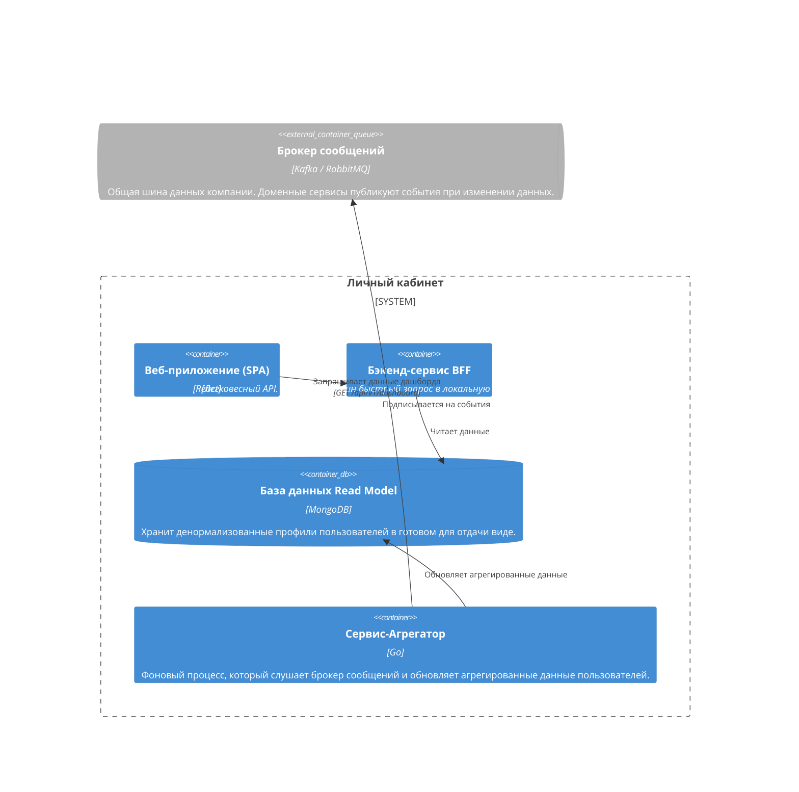

# C4, уровень 2 — Containers

```mermaid
C4Container

System_Boundary(cabinet, "Личный кабинет") {
    Container(spa, "Веб-приложение (SPA)", "React")
    Container(bff, "Бэкенд-сервис BFF", "Легковесный API. Выполняет один быстрый запрос в локальную базу данных личного кабинета.")
    ContainerDb(readModel, "База данных Read Model", "MongoDB", "Хранит денормализованные профили пользователей в готовом для отдачи виде.")
    Container(aggregator, "Сервис-Агрегатор", "Go", "Фоновый процесс, который слушает брокер сообщений и обновляет агрегированные данные пользователей.")
}

ContainerQueue_Ext(broker, "Брокер сообщений", "Kafka / RabbitMQ", "Общая шина данных компании. Доменные сервисы публикуют события при изменении данных.")

Rel(spa, bff, "Запрашивает данные дашборда", "GET /api/v1/dashboard")
Rel(bff, readModel, "Читает данные")
Rel(aggregator, broker, "Подписывается на события")
Rel(aggregator, readModel, "Обновляет агрегированные данные")
```
