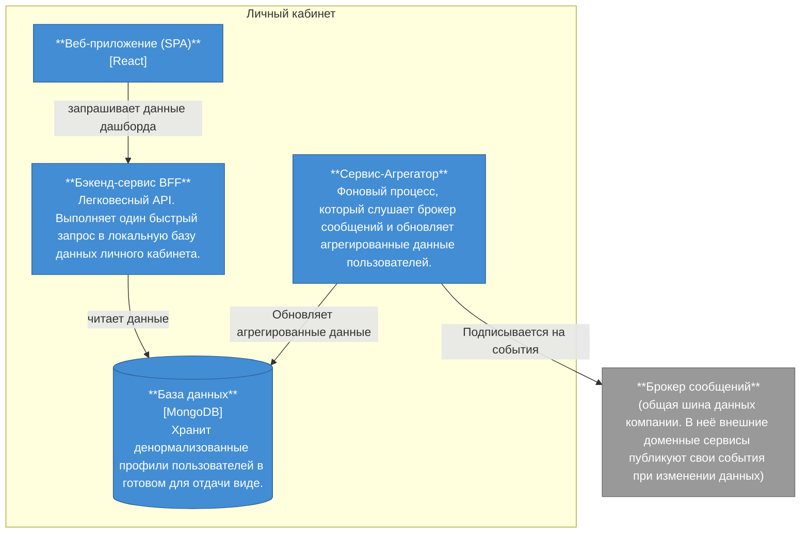

# C4, уровень 2 — Containers

```mermaid
flowchart TB
    broker["**Брокер сообщений**<br/>(общая шина данных компании. В неё внешние доменные сервисы публикуют свои события при изменении данных)"]

    subgraph ns["Личный кабинет"]
        web["**Веб-приложение (SPA)**<br/>[React]"]
        db[("**База данных**<br/>[MongoDB]<br/>Хранит денормализованные профили пользователей в готовом для отдачи виде.")]
        bff["**Бэкенд-сервис BFF**<br/>Легковесный API. Выполняет один быстрый запрос в локальную базу данных личного кабинета."]
        agregator["**Сервис-Агрегатор**<br/>Фоновый процесс, который слушает брокер сообщений и обновляет агрегированные данные пользователей."]
    end

    web --> |"запрашивает данные дашборда"| bff
    bff --> |"читает данные"| db
    agregator --> |"Обновляет агрегированные данные"| db
    agregator --> |"Подписывается на события"| broker

    classDef container fill:#438dd5,stroke:#2e6295,color:#ffffff;
    classDef external fill:#999999,stroke:#6b6b6b,color:#ffffff;
    class web,bff,agregator,db container;
    class broker external;
```
