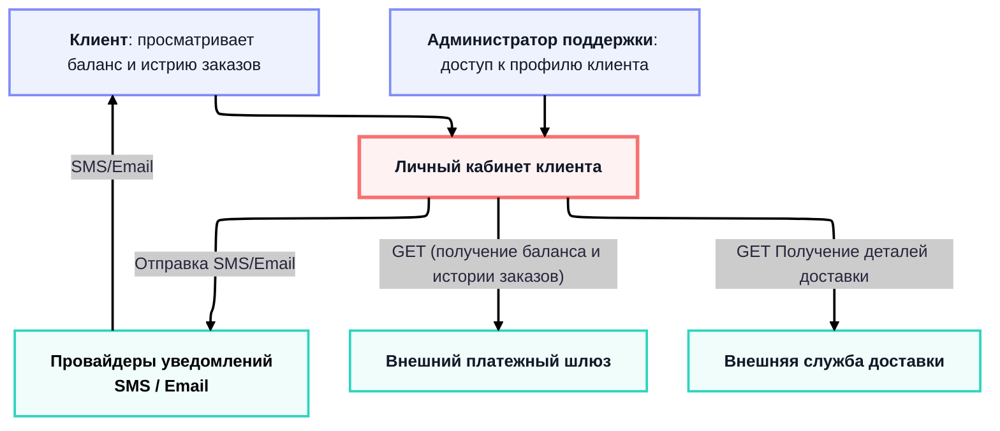

# C4, уровень 1 — System Context

```mermaid
---
config:
  theme: redux
  layout: elk
---
flowchart TB
    client["`**Клиент**: просматривает баланс и истрию заказов`"] --> cabinet["`**Личный кабинет клиента**`"]
    admin["`**Администратор поддержки**: доступ к профилю клиента`"] --> cabinet
    notify["`**Провайдеры уведомлений**<br>**SMS / Email**`"] -- "SMS/Email" --> client
    cabinet -- "Отправка SMS/Email" --> notify
    cabinet -- "GET (получение баланса и истории заказов)" --> payment["`**Внешний платежный шлюз**`"]
    cabinet -- "GET Получение деталей доставки" --> delivery["`**Внешняя служба доставки**`"]

     client:::actor
     cabinet:::system
     admin:::actor
     notify:::external
     payment:::external
     delivery:::external
    classDef actor fill:#eef2ff,stroke:#818cf8,color:#111827
    classDef system fill:#fef2f2,stroke:#f87171,color:#111827,stroke-width:3px
    classDef external fill:#f0fdfa,stroke:#2dd4bf,color:#111827
    style notify color:#000000
```
