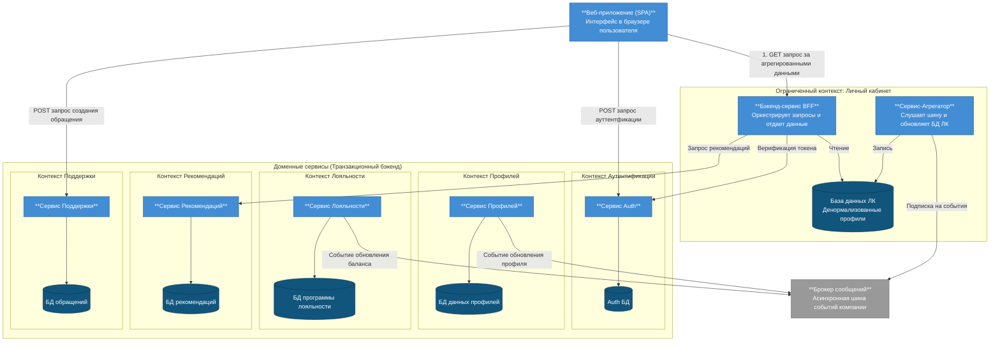

# Диаграмма декомпозиции

```mermaid
flowchart TB
    web["**Веб-приложение (SPA)**<br/>Интерфейс в браузере пользователя"]

    subgraph lk_boundary["Ограниченный контекст: Личный кабинет"]
        bff["**Бэкенд-сервис BFF**<br/>Оркестрирует запросы и отдает данные"]
        db_lk[("База данных ЛК<br/>Денормализованные профили")]
        agregator["**Сервис-Агрегатор**<br/>Слушает шину и обновляет БД ЛК"]
    end

    broker["**Брокер сообщений**<br/>Асинхронная шина событий компании"]

    subgraph domain_services["Доменные сервисы (Транзакционный бэкенд)"]
        subgraph srv_auth_box["Контекст Аутентификации"]
            srv_auth["**Сервис Auth**"]
            db_auth[("Auth БД")]
        end
        subgraph srv_profile_box["Контекст Профилей"]
            srv_profile["**Сервис Профилей**"]
            db_profile[("БД данных профилей")]
        end
        subgraph srv_loyalty_box["Контекст Лояльности"]
            srv_loyalty["**Сервис Лояльности**"]
            db_loyalty[("БД программы лояльности")]
        end
        subgraph srv_recommend_box["Контекст Рекомендаций"]
            srv_recommend["**Сервис Рекомендаций**"]
            db_recommend[("БД рекомендаций")]
        end
        subgraph srv_support_box["Контекст Поддержки"]
            srv_support["**Сервис Поддержки**"]
            db_support[("БД обращений")]
        end
    end

    web --> |"1. GET запрос за агрегированными данными"| bff
    web --> |"POST запрос ауттентфикации"| srv_auth
    web --> |"POST запрос создания обращения"| srv_support

    bff --> |"Чтение"| db_lk
    agregator --> |"Запись"| db_lk
    agregator --> |"Подписка на события"| broker

    srv_auth --> db_auth
    srv_profile --> db_profile
    srv_loyalty --> db_loyalty
    srv_recommend --> db_recommend
    srv_support --> db_support

    srv_profile --> |"Событие обновления профиля"| broker
    srv_loyalty --> |"Событие обновления баланса"| broker

    bff --> |"Запрос рекомендаций"| srv_recommend
    bff --> |"Верификация токена"| srv_auth

    classDef container fill:#438dd5,stroke:#2e6295,color:#ffffff;
    classDef database fill:#11557c,stroke:#0b334b,color:#ffffff;
    classDef external fill:#999999,stroke:#6b6b6b,color:#ffffff;
    class web,bff,agregator,srv_auth,srv_profile,srv_loyalty,srv_recommend,srv_support container;
    class db_lk,db_auth,db_profile,db_loyalty,db_recommend,db_support database;
    class broker external;
```
